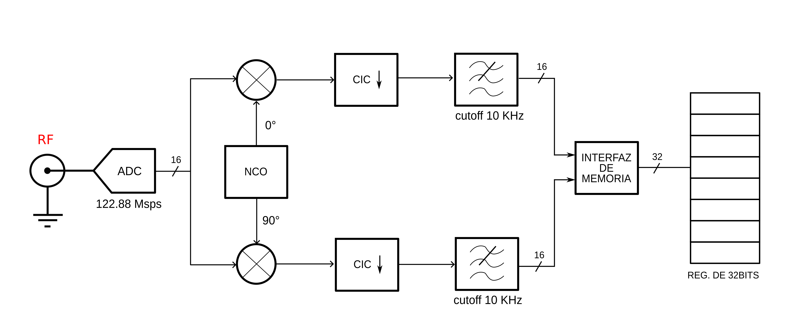

# Módulos utilizados para el receptor

A continuación se presenta el diagrama de bloques del hardware del proyecto.



En este repositorio se encuentran los código RTL  de la implementación realizada, el módulo principal
es *dsp.v*, en este mismo se instancia todos los módulos utilizados. La organización de la
carpeta **receptor** se ilustra a continuación.

```
    .
    ├── constraint
    │   └── ports.xdc
    ├── archivos
    │   ├── filter_core
    |   │   ├── files
    |   |   └── fir_LPF.ipynb
    │   ├── bram_core
    |   |   ├── bram_conect.v
    |   |   └── enable_slicer.v
    │   └── dsp_top
    |       ├── dsp_top.v
    |       ├── bram_conect.v
    |       ├── enable_slicer.v
    |       └── mixed.v
    |
    └── img
```

Se utilizaron las siguientes *Intelectual Property* de Vivado:
- DDS Compiler: Para la generación de las portadoras.
- FIR Compiler: Para el diseño del filtro FIR.
- CIC Compiler: Para el diseño del filtro encargado de la decimación.
- Block Memory Generator: Para el buffer de memoria, se lo utilizo en el modo True Dual-Port RAM.