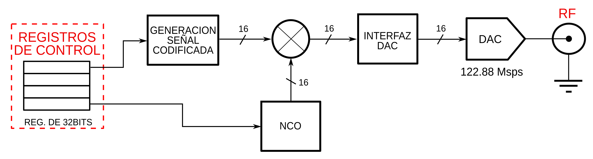

# Módulos utilizados para el transmisor

A continuación se presenta el diagrama de bloques del hardware del proyecto.



En este repositorio se encuentran los código RTL  de la implementación realizada, el módulo principal
es *tx_radar.v*, en este mismo se instancia todos los módulos utilizados. La organización de la
carpeta **transmisor** se ilustra a continuación.

```
    .
    ├── constraint
    │   └── ports.xdc
    ├── archivos
    │   ├── sinc_top
    |   │   ├── sinc_generator.v
    |   |   └── sinc_generator_tb.v
    │   ├── code_top
    |   |   ├── code_top.v
    |   |   ├── code_generator.v
    |   |   ├── code_signal.v
    |   |   ├── code_top_tb.v
    |   |   └── sinc_generator.v
    │   └── tx_top
    |       ├── ip
    |       |   ├── oscilador.xcix
    |       |   └── mezclador.xcix   
    |       ├── tx_radar.v
    |       ├── code_top.v
    |       ├── code_signal.v
    |       ├── code_generator.v
    |       ├── pll.v
    |       └── sinc_generator.v
    |
    └── img
    ```